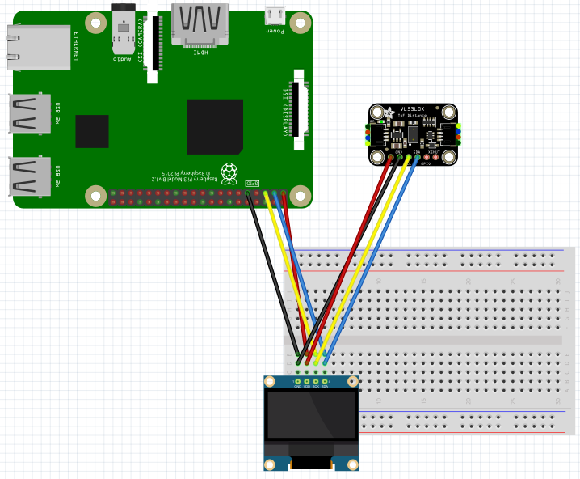

# 距離センサー「VL53L0X」(Time-of-flight)確認
距離センサー「VL53L0X」を使用した、距離識別の確認です。

## 事前準備

- 以下のコマンドで、VL53L0X用のライブラリをインストールする
  > pip3 install adafruit-circuitpython-vl53l0x
  
- 以下のコマンドで、SSD1306用のライブラリをインストールする
  > pip3 isntall adafruit-circuitpython-ssd1306
  
- 以下のコマンドを実行し、表示用のフォント(Noto)をインストールする
  > sudo apt-get install fonts-noto

  これにより、ソースで指定されている`/usr/share/fonts/opentype/noto/`に`NotoSansCJK-Regular.ttc`が保存されます。

## 接続方法
下図のとおり接続してください。

</src>

  - VL53L0XをI2C(SDA/SCL)につなぐと、アドレス0x29に接続されます。
  - SSD1306をI2C(SDA/SCL)につなぐと、アドレス0x3Cに接続されます。
  - うまく表示されない場合は、下図のコマンドで接続できているか確認しましょう。

</src>

## 実行コマンドと結果
以下の通り、コマンドを実行します。
  > python3 dispDistance.py  

下のように距離が表示されます。  
</src>

